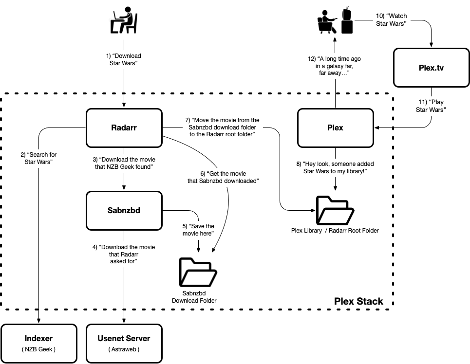

# Plexstack

This project includes a docker-compose file and a directory structure that creates 
a group of docker containers that run web applications (Sonarr and Radarr) for finding 
and downloading videos from usenet and then displaying that video on Plex.

# Table of Contents

 - [Overview](#overview)
 - [Clone and set up .env](#clone)
 - [Start the servers](#startup)
 - [Enable access to SAB](#sab-access)
 - [Initial SAB Configuration (Usenet and Download Folders)](#sab-config)
 - [Configure SAB into Sonarr and Radarr](#sab-rr)
 - [Configure the Indexer into Sonarr and Radarr](#sab-indexer)
 - [Configure Root Folders into Sonarr and Radarr](#root-folders)
 - [Claim and Configure Plex](#claim-plex)
 - [Additional Coniguration](#extra)

<a name="overview"></a>
# Overview 

The group of containers includes the following components:
 - A download client (SAB)
 - A movie search tool (Radarr)
 - A TV search tool (Sonarr)
 - A video asset database and streaming application (Plex)

The following services are used:
 - An NZB indexer (such as NZB Geek)
 - A Usenet service provider (such as Astraweb)
 - Plex
   


<a name="clone"></a>
# Clone and set up .env 

Clone this project to a working directory, cd into it, and then edit `.env` with your favorite editor to have the
following contents:

```
UID=1001
GID=1001
TZ=America/Denver
MEDIA_ROOT=/users/plex/plexmedia
PLEXSTACK_HOME=/opt/plexstack
SABNZBD_PORT=9991
SONARR_PORT=9992
RADARR_PORT=9993
```

★ Set the UID and GID to be your user's UID and GID (which you can find with the `id` command).

★ Set TZ to be your local time zone.

★ Set MEDIA_ROOT to be the root of where your TV and Movies are stored.

★ PLEXSTACK_HOME should be the working directory where you cloned this repository.

You can leave the ports alone, or change them if you're already using those ports for something else on your host.

<a name="startup"></a>
# Start the servers 

★ While in PLEXSTACK_HOME, enter the following command to start the servers:

```
docker compose up -d
```

This starts the containers in the background.  You can see the console output of all the servers with:

```
docker compose logs -f
```

<a name="sab-access"></a>
# Enable access to SAB 

SAB will block access to the web site from hosts it doesn't recognize.  

If you try to access SAB now at http://hostname:9991/, you'll get this message:

```
Access denied - Hostname verification failed: https://sabnzbd.org/hostname-check
```

To allow access, you need to adjust a config setting in a config file that is created after sabnzb starts up.

Assuming you've already started the containers in the previous step, SAB should have created 
the config file you need to edit.   

★ First, shut down the containers down again:

```
docker compose down
```

★ Now edit `sabnzbd/config/sabnzbd.ini`, find the setting for `host_whitelist` and add all the hostnames 
that will be used to connect to sabnzbd.

★ You must include `sabnzbd` as one of the hostnames -- that's the hostname that other containers will use 
to refer to this server.

★ Then re-start the containers with `docker-compose up -d`.

<a name="sab-config"></a>
# Initial SAB Configuration (Usenet and Download Folders) 

★ First, visit the SAB web page at http://hostname:9991/.  You'll be presented with a quick-start wizard.  Pick your language and then 
click "Start Wizard >".  

★ On the next page, enter the requested information about your usenet service provider.  Check the advanced settings; 
my usenet service provider allows me 50 simultaneous connections, many more than the default value in SAB.
Use the "Test Server" button to validate the information and then click "Next >".  

★ Click the gear icon to configure the download folders. You'll be directed to the folder configuration area, http://hostname:9991/sabnzbd/config/folders 

★ Change the Temporary Download Folder to `/incomplete-downloads`.

★ Change the Completed Download Folder to `/downloads`.

★ Click "Save Changes"

<a name="sab-rr"></a>
# Configure SAB into Sonarr and Radarr 

## Get the NZB Key from SAB and allow external access

Visit the SAB general configuration page.  It's available at this URL: http://hostname:9991/config/general/

Alternatively, you can find the general configuration page from the home screen (http://hostname:9991/) 
by clicking on the gear icon to get to a system info page, then clicking on the "General" top-nav item; 
it has a gear icon.

★ Copy the "API Key" from the "Security" section of this page.  *(Note: The NZB key seems more appropriate for use by Sonarr, 
but this didn't work when I tried it.)*

★ While you're on this page, change the "External internet access" setting to be "Add NZB files", then click "Save Changes".

## Configure SAB into Sonarr

Visit the Sonarr Download Clients configuration page.  It's available at this URL: http://hostname:9992/settings/downloadclients

Alternatively, you can find the Download Clients configuration page from the home screen (http://hostname:9992/) 
by clicking "Settings" in the side-nav, and then clicking on "Download Clients". 

★ From the Download Clients configuration page, click the big "plus" icon, and then click on "SABnzbd" in the "Usenet" section.

★ You'll need to enter the following information:

 - Name: SAB (or whatever you want to name it)
 - Host: sabnzbd (this is the hostname docker compose set up for the containers to use when talking to each other)
 - API Key: enter the NZB you copied from SAB in the previous step

Note: leave the port at the default 8080; don't change it to 9991. 9991 is the port exposed by docker for access from the outside.

★ Hit the "Test" button, then hit "Save".

### Weird Error?

If you get an error message that says "Test was aborted due to an error: Object reference not set to an instance of an object" and 
you see the following in the log:

```
sonarr   | [v3.0.10.1567] System.NullReferenceException: Object reference not set to an instance of an object
sonarr   |   at NzbDrone.Core.Download.Clients.Sabnzbd.Sabnzbd+<GetCategories>d__10.MoveNext () [0x000b4] in C:\BuildAgent\work\63739567f01dbcc2\src\NzbDrone.Core\Download\Clients\Sabnzbd\Sabnzbd.cs:233 
sonarr   |   at System.Linq.Enumerable.TryGetFirst[TSource] (System.Collections.Generic.IEnumerable`1[T] source, System.Func`2[T,TResult] predicate, System.Boolean& found) [0x0004f] in <69ada62907b24213a012734531df1db1>:0 
sonarr   |   at System.Linq.Enumerable.FirstOrDefault[TSource] (System.Collections.Generic.IEnumerable`1[T] source, System.Func`2[T,TResult] predicate) [0x00000] in <69ada62907b24213a012734531df1db1>:0 
sonarr   |   at NzbDrone.Core.Download.Clients.Sabnzbd.Sabnzbd.TestCategory () [0x00012] in C:\BuildAgent\work\63739567f01dbcc2\src\NzbDrone.Core\Download\Clients\Sabnzbd\Sabnzbd.cs:434 
sonarr   |   at NzbDrone.Core.Download.Clients.Sabnzbd.Sabnzbd.Test (System.Collections.Generic.List`1[T] failures) [0x00024] in C:\BuildAgent\work\63739567f01dbcc2\src\NzbDrone.Core\Download\Clients\Sabnzbd\Sabnzbd.cs:273 
sonarr   |   at NzbDrone.Core.Download.DownloadClientBase`1[TSettings].Test () [0x00006] in C:\BuildAgent\work\63739567f01dbcc2\src\NzbDrone.Core\Download\DownloadClientBase.cs:113 
```

... then you can fix this by going to Sabnzb's category configuration page (http://hostname:9991/sabnzbd/config/categories/), 
adding a category (I added one for books), then returning to Sonarr and testing again.

I found this fix on [the sonarr forums](https://forums.sonarr.tv/t/object-reference-error-while-adding-download-client/30990).

## Configure SAB into Radarr

Perform the same steps again for Radarr (http://hostname:9992/). 

★ From the Download Clients configuration page, click the big "plus" icon, and then click on "SABnzbd" in the "Usenet" section.

★ Enter the name (SAB), host (sabnzbd), and API Key (from SAB; the same key you put in Sonarr).

★ Hit the "Test" button, then hit "Save".

<a name="sab-indexer"></a>
# Configure the Indexer into Sonarr and Radarr

## Configure the Indexer into Sonarr

The configure indexers page for Sonarr is here: http://mini:9992/settings/indexers

It can be reached through the UI by clicking the "Settings" entry in the side-nav, and then clicking on "Indexers".

★ From the Indexers configuration page, click the big "plus" icon and then on the protocol your indexer supports.  (For my indexer, NZB Geek, the protocol is Newznab.)

★ Enter a name for your indexer, your indexer's URL, and your indexer's API key.  Then click "Test" and "Save".  *(Note, your indexer probably has a separate URL for use by Sonarr/Radarr than the one you visit in a web browser.  NZB Geek's URL is http://nzbgeek.info, but I need to configure http://api.nzbgeek.info into Sonarr/Radarr.)*

## Configure the Indexer into Radarr

The steps to configure your indexer into Radarr are the same as for Sonarr.

The configure indexers page for Radarr is here: http://hostname:9993/settings/indexers

★ From the Indexers configuration page, click the big "plus" icon and then on the protocol your indexer supports.  

★ Enter a name for your indexer, your indexer's URL, and your indexer's API key. Then click "Test" and "Save".  

<a name="root-folders"></a>
# Configure Root Folders into Sonarr and Radarr 

After movies and series are done downloading, Sonarr and Radarr move them from the `Downloads` folder on the local machine
to the local `Root Folder`, but we need to configure that folder.

## Configure the Root Folder in Sonarr

Visit the Sonarr "Media Management" configuration page at this URL: http://hostname:9992/settings/mediamanagement

Alternatively, you can find the Media Management page from the home screen by clicking "Settings" in the side-nav and
then clicking on "Media Management".

★ Click the big blue "Add Root Folder" at the bottom of the page, select the folder named "root-folder" (the path will say `/root-folder/`)
and then click "Ok".

This should be repeated if you're linking with multiple Plex folders; I also added `bill-series`.

## Import previously-downloaded TV into Sonarr

This is only necessary if you already have TV in the Sonarr's root folder (in the plex library).

★ In the "Media Management" configuration page, click on the root folder link ("/root-folder").  Wait while Sonarr inspects all
the shows, and then click the "Import" button at the bottom of the page.

Repeat, if necessary, for additional root folders.

## Configure the Root Folder in Radarr

Same as with Sonarr; visit the "Media Management" configuration page at: http://hostname:9993/settings/mediamanagement

★ Click the "Add Root Folder" button, select the folder named "root-folder" and click OK.

Repeat as for additional Plex folders; I also added `bill-movies`.

## Import previously-downloaded TV into Radarr

This is only necessary if you already have movies in Radarr's root folder (in the plex library).

★ In the "Media Management" configuration page, click on the root folder link ("/root-folder").  Wait while Radarr inspects all
the movies, and then click the "Import" button at the bottom of the page.

Repeat, if necessary, for additional root folders.

<a name="claim-plex"></a>
# Claim and Configure Plex

## Claim Plex

The following steps assume you already have a Plex account.  You can create one at http://plex.tv

★ Go to https://plex.tv/claim and generate a "claim code".  **You now have FOUR MINUTES to complete the 
rest of the configuration.**  Fortunately, it's pretty easy.

★ Edit docker-compose.yml and add `PLEX_CLAIM` to the environment variables of the plex container, like this:

```
  plex:
    image: lscr.io/linuxserver/plex:latest
    container_name: plex
    network_mode: host
    environment:
      - PLEX_CLAIM=claim-yvEzxAynBf2TdQbY-oWz
      - PUID=${UID:?missing required UID environment variable}
...
```

★ Stop and re-start the plex container.  I do this to stop and start all the containers:

```
$ docker compose down
$ docker compose up -d
```

★ Check the logs to see if the claim was successful:

```
$ docker logs plex
```

You should see a line like this:

```
Server claimed successfully, navigate to http://serverip:32400/web to complete plex setup.
````

If you took too long, then you may need to try again.

★ Edit docker-compose.yml and remove the `PLEX_CLAIM` environment variable.

## Configure Plex

Once the server is claimed, you can go to http://hostname:32400 and follow the steps in the setup wizard. You
will need to give the server a name and indicate which directories have movies and which ones have TV shows.

<a name="extra"></a>
# Additional Coniguration 

The following additional configuration is not required, but were useful to me in my use of the plex stack.

## Disable Downloading of ISOs

~~In SAB's "Switches" configuration (http://mini:9991/config/switches/), there is an "Unwanted Extensions" field.  Enter "iso" in 
there and click "Save Changes".~~  This doesn't work.  I haven't found any way to make this work.  Please let me know if you've got a simple reliable way to prevent downloading of ISOs.

## Configure Additional / Fewer Media Sources

I have two additional sources of media: Bill's Series and Bill's Movies.  You probably don't have these, and should delete them
from the "volumes" section of the plex container in your `docker-compose.yml`.  Or maybe you have other additional sources,
in which case, you should configure your`docker-compose.yml` accordingly.
